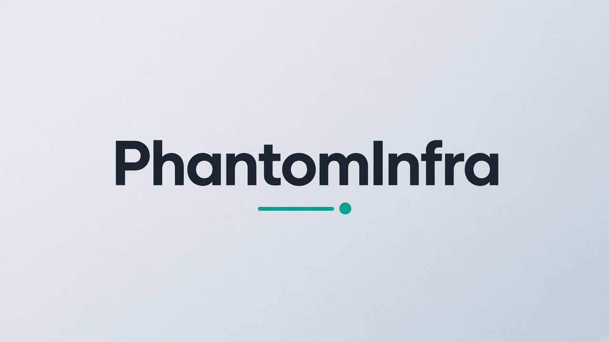
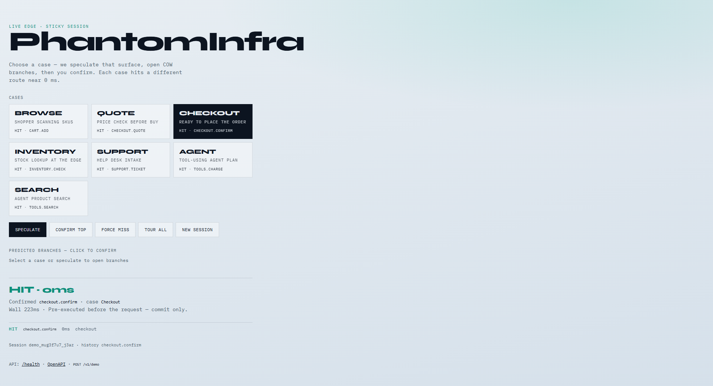

<p align="center">
  
</p>

<p align="center">
  <strong>Speculative zero-latency edge engine</strong> — branch prediction for the cloud.
</p>

<p align="center">
  <a href="https://phantominfra-edge.matthewlooney5.workers.dev/"></a>
  <a href="docs/CHANGELOG.md"></a>
  <a href="LICENSE"></a>
  <a href="docs/ACQUISITION.md"></a>
  <a href="docs/IP.md"></a>
  <a href=".github/FUNDING.yml"></a>
</p>

**Live:** https://phantominfra-edge.matthewlooney5.workers.dev

**Pre-revenue. Diligence-ready.** The asset is the runtime IP, Cloudflare reference edge, and acquirer-shaped adapters — not ARR.

Predict the next API/tool call → pre-execute on a COW branch (shadow side effects) → **commit** on hit (~0ms) or **roll back** on miss.

## Live demo

**Open the playground:** [https://phantominfra-edge.matthewlooney5.workers.dev](https://phantominfra-edge.matthewlooney5.workers.dev)

No install. Pick a case (Browse, Quote, Checkout, Inventory, Support, Agent, Search), speculate, confirm — or **Tour all**. Click **Prove it** for a live HIT vs MISS speedup.

<p align="center">
  <a href="https://phantominfra-edge.matthewlooney5.workers.dev/"></a>
</p>

<p align="center">
  
</p>

GitHub Pages front door (enable **Settings → Pages → Deploy from branch → `/docs`**): [`docs/index.html`](docs/index.html) — points at the live Worker.

## Why it matters

| Proof | Where |
|-------|--------|
| ~1000×+ hit vs miss (demo bench) | `npm run bench` |
| Workers + DO + KV mesh | `apps/edge` |
| Cloudflare / Vercel / Node adapters | `@phantominfra/adapters` |
| Whitepaper + acquisition + IP | [`docs/whitepaper.md`](docs/whitepaper.md), [`docs/ACQUISITION.md`](docs/ACQUISITION.md), [`docs/IP.md`](docs/IP.md) |
| Threat model | [`SECURITY.md`](SECURITY.md) |
| Audit export | `engine.exportAuditBundle()` / `GET …/audit` |

## Monorepo (v1.4.2)

| Package | Role |
|---------|------|
| `@phantominfra/runtime` | Engine, predictor, policy, ledger, value/audit |
| `@phantominfra/sdk` | HTTP + SSE client |
| `@phantominfra/adapters` | Workers / Vercel Edge / Node drop-ins |
| `@phantominfra/web` | Landing + demos |
| `@phantominfra/edge` | Cloudflare production-shaped reference |

## Quick start (local)

```bash
npm install
npm test && npm run bench
npm run dev          # http://localhost:5173
npm run dev:edge     # http://127.0.0.1:8787
```

Local API key: `dev_phantom_key` · OpenAPI: `/openapi.json` · Deploy: [DEPLOY.md](./DEPLOY.md) · Live notes: [docs/LIVE.md](./docs/LIVE.md)

## Adapter sketch

```ts
import { PhantomEngine } from "@phantominfra/runtime";
import { createWorkersFetchHandler } from "@phantominfra/adapters";

const engine = new PhantomEngine({ initialState: { ... } });
// register routes…

export default {
  fetch: createWorkersFetchHandler({
    engine,
    resolveRoute: (req) => new URL(req.url).pathname.slice(1),
    alwaysSpeculate: true,
  }),
};
```

## Diligence / IP

- [Acquisition brief](docs/ACQUISITION.md)
- [Data room index](docs/DATA-ROOM.md)
- [IP inventory](docs/IP.md)
- [IP assignment outline](docs/ASSIGNMENT.md)
- [Term sheet outline](docs/TERM-SHEET-OUTLINE.md)
- [Patent / trade-secret notice](docs/PATENT-NOTICE.md)
- [Commercial license](docs/LICENSE-COMMERCIAL.md) · [Evaluation license](docs/LICENSE-EVALUATION.md)
- [Whitepaper](docs/whitepaper.md)
- [One-pager](docs/one-pager.html) (Print → PDF)
- [Changelog](docs/CHANGELOG.md)
- Brand: [`brand/logo.svg`](brand/logo.svg) · [`brand/wordmark.png`](brand/wordmark.png)

## License

**Proprietary** — All Rights Reserved. Not open source.

- Root terms: [`LICENSE`](LICENSE)
- Evaluation / demo: [`docs/LICENSE-EVALUATION.md`](docs/LICENSE-EVALUATION.md)
- Commercial production: [`docs/LICENSE-COMMERCIAL.md`](docs/LICENSE-COMMERCIAL.md)
- Exclusive sale: [`docs/ASSIGNMENT.md`](docs/ASSIGNMENT.md) · [`docs/ACQUISITION.md`](docs/ACQUISITION.md)
- Third-party OSS: [`NOTICE`](NOTICE)

Maintainer [@theworker02](https://github.com/theworker02) · [thanks.dev/u/gh/theworker02](https://thanks.dev/u/gh/theworker02)
